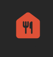
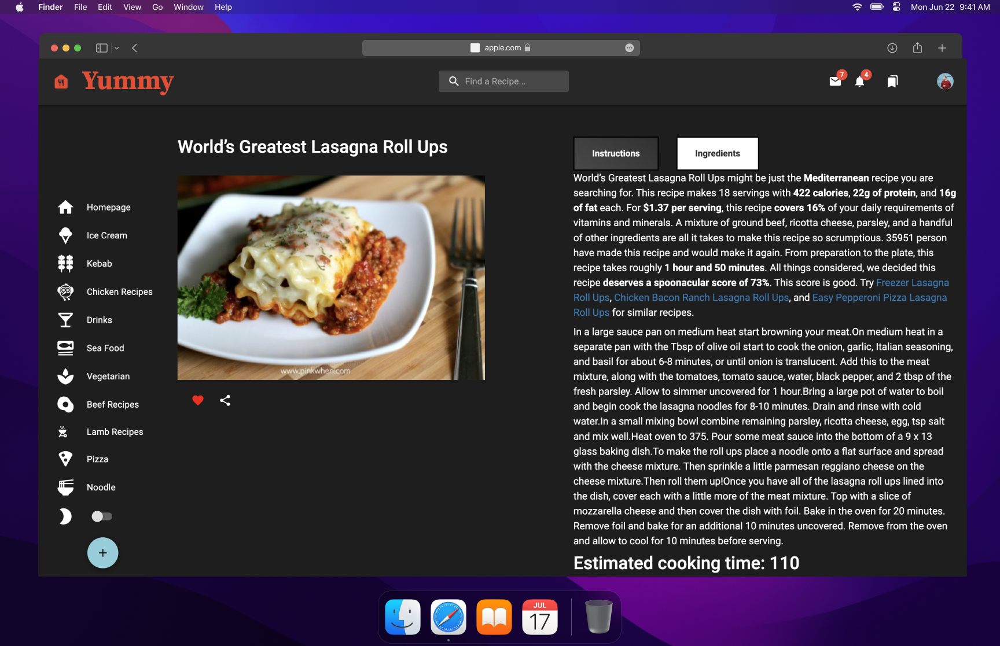

# Hi there, I'm Linfeng Chen 👋

## I'm a Husband, Father, Student and Developer!!

- 🔭 Check out my Linkin Page: [Linkedin](https://www.linkedin.com/in/linfeng-chen-a73105244/)!
- 🌱 I’m currently learning everything 🤣
- 👯 I’m looking to collaborate with Pro Coder
- 🥅 2022 Goals: Learn more about React
- ⚡ Fun fact: I love to and play Vedio Game
- 😻 Check out the other project I created: [Pokeman Go](https://github.com/danielchen2003/PokemanGoV1.0)

</details>

[website]: https://codeSTACKr.com
[course]: http://vsCodeHero.com
[twitter]: https://twitter.com/codeSTACKr
[youtube]: https://youtube.com/codeSTACKr
[instagram]: https://instagram.com/codeSTACKr
[linkedin]: https://linkedin.com/in/codeSTACKr
[webdevplaylist]: https://www.youtube.com/playlist?list=PLkwxH9e_vrAJ0WbEsFA9W3I1W-g_BTsbt
[jsplaylist]: https://www.youtube.com/playlist?list=PLkwxH9e_vrALRJKu7wfXby3MKeflhTu6B
[cssplaylist]: https://www.youtube.com/playlist?list=PLkwxH9e_vrALSdvZuEh6gqQdmDoDIoqz4
[reactplaylist]: https://www.youtube.com/playlist?list=PLkwxH9e_vrAK4TdffpxKY3QGyHCpxFcQ0

# Yummy-Yummy

A Recipe Sharing and searching App

## Logo

 

### Languages and Tools:

[][webdevplaylist]
[][webdevplaylist]
[][cssplaylist]
[][cssplaylist]
[][jsplaylist]
[][reactplaylist]
[][webdevplaylist]
[][webdevplaylist]
[][webdevplaylist]

[][webdevplaylist]
[][webdevplaylist]
[][webdevplaylist]
[](https://www.youtube.com/playlist?list=PLkwxH9e_vrAJ0WbEsFA9W3I1W-g_BTsbt#gh-dark-mode-only)
[](https://www.youtube.com/playlist?list=PLkwxH9e_vrAJ0WbEsFA9W3I1W-g_BTsbt#gh-light-mode-only)
[](https://www.youtube.com/playlist?list=PLkwxH9e_vrAJ0WbEsFA9W3I1W-g_BTsbt#gh-light-mode-only)

<br />
<br />

## Basic Features

1. Allow user search recipes in the Api.
2. Create/Delete your recipe.
3. View other people's recipes and react to it with a like or bookmark it to your dashboard.
4. Check recent our popular pick recipes.
5. Check recent our Veggie pick recipes.
6. Browse recipes from various countries.
7. Explore recipes by various dish categories such as Pizza, Kebob, IceCream.
8. Discover new recipes through different ingredient.
9. Perfect presentation of recipes on the iphone and other smartphone screems.
10. Nice looking no match page with animation and pngs.
11. Receving Data from spoonacular API by Axios.

## Upcoming features

- Allow user to register as well as login and logout.
- Allow user to define your own search recommendations on the home page.
- Get search result and load as fast as possible.
- Show the new recipe on the main page when people post a new recipe.
- Allow user to change other's recipe and put into their own bookmark.

## Component hierarchy

 <table>
  <tr>
     <td>Yummy-App Component hierarchy digram</td>
     
  </tr>
  <tr>
     <td valign="top"></td>
    
  </tr>
 </table>

<br />
<br />

## Desktop ShowCase

<table>
  <tr>
     <td>New Recipe Post Page</td>
      <td>Recipe Ingredients View</td>
     
  </tr>
  <tr>
    <td valign="top"></td>
    <td valign="top"></td>
    
    
  </tr>
  <tr>
    <td>Recipe Create Page</td>
     <td>Recipe Instructions View</td>
  </tr>
  <tr>
  <td valign="top"></td>
    <td valign="top"></td>
    
  </tr>
 </table>

<br />
<br />

## Presentation on Iphone 12

<table>
  <tr>
     <td>New Recipe Post Page</td>
     <td>My Favorites Page</td>
  </tr>
  <tr>
    <td valign="top"></td>
    <td valign="top"></td>
    
  </tr>
  <tr>
     <td>Footer View</td>
     <td>Recipe Post</td>
  </tr>
  <tr>
    <td valign="top"></td>
    <td valign="top"></td>
    
  </tr>
 </table>

## Change Theme

 <table>
  <tr>
     <td>Light Theme</td>
     
  </tr>
  <tr>
    <td valign="top"></td>
   
    
  </tr>
  <tr>
     <td>Dark Theme</td>
     
  </tr>
  <tr>
     <td valign="top"></td>
    
  </tr>
 </table>
 
## Others
  <table>
  <tr>
     <td>No Match Page</td>
     
  </tr>
  <tr>
    <td valign="top"></td>
   
    
  </tr>
  <tr>
     <td>Loading Page</td>
     
  </tr>
  <tr>
     <td valign="top"></td>
    
  </tr>
 </table>

## Wireframe

<table>
<tr>
     <td>Wireframe Your App</td>
     
  </tr>
  <tr>
     <td valign="top"></td>
    
  </tr>
 </table>

## Install

```sh
npm install
```

## Usage

```sh
npm start
```

## Technologies Used

- React.js
- Javascript
- Material UI
- SCSS
- Css
- HTML
- Material Design
- NPM package
- Bootstrap 5
- Local storage
- Material Icons
- Axios
- Figma
- Prettier

## License

Usage is provided under the [MIT License](http://opensource.org/licenses/mit-license.php). See LICENSE for the full details.

<h3>Demo: https://illustrious-malabi-aabace.netlify.app/</h3>

<h3 align="center">
  A web app to search and save favorites recipes using TheMealDB API
</h3>

<p align="center">
  <a href="https://app.circleci.com/pipelines/github/santarelle/recipe-app?branch=dev">
    
  </a>
  
  
  
  
  
  <a href="https://github.com/santarelle/recipe-app/commits/master">
    
  </a>
  
  <a href="https://github.com/santarelle/recipe-app/issues">
    
  </a>
</P>

<p align="center">

  <a href=https://www.linkedin.com/in/linfeng-chen-a73105244/ target="_blank">
    
  </a>
  <a href="https://github.com/danielchen2003" target="_blank">
    
  </a>
  <a href=https://www.linkedin.com/in/linfeng-chen-a73105244/  target="_blank" >
    
  </a>
  <a href="ku2003ku@@gmail.com" target="_blank" >
    
  </a>
</p>

<p align="center">
  <a href="#computer-languages">Languages</a>&nbsp;&nbsp;&nbsp;|&nbsp;&nbsp;&nbsp;
  <a href="#books-technologies">Technologies</a>&nbsp;&nbsp;&nbsp;|&nbsp;&nbsp;&nbsp;
  <a href="#install">Install</a>&nbsp;&nbsp;&nbsp;|&nbsp;&nbsp;&nbsp;
  <a href="#books-usage">Usage</a>&nbsp;&nbsp;&nbsp;|&nbsp;&nbsp;&nbsp;
  <a href="#user-stories">User Stories</a>&nbsp;&nbsp;&nbsp;
</p>

## User Stories

- User can see a list of recipe titles
- User can click a recipe title to display a recipe card containing the
  recipe title, meal type (Italian,US,Chinese), number of people
  it serves, the listof ingredients (including their amounts), and the preparation steps.

- User can see a photo showing what the item looks like after it has
  been prepared.
- User can search for a recipe not in the list of recipe titles by
  entering the meal name into a search box and clicking a 'Search' button. Any
  open source recipe API may be used as the source for recipes (see The MealDB
  below).
- User can see a list of recipes matching the search terms
- User can click the name of the recipe to display its recipe card.
- User can see a warning message if no matching recipe was found.
- User can click a 'like' button on the cards for recipes located through
  the API to save a copy to this apps recipe file in local storage.

## Author

👤 **Linfeng Chen**

- Github: [@danielchen2003](https://github.com/danielchen2003)
